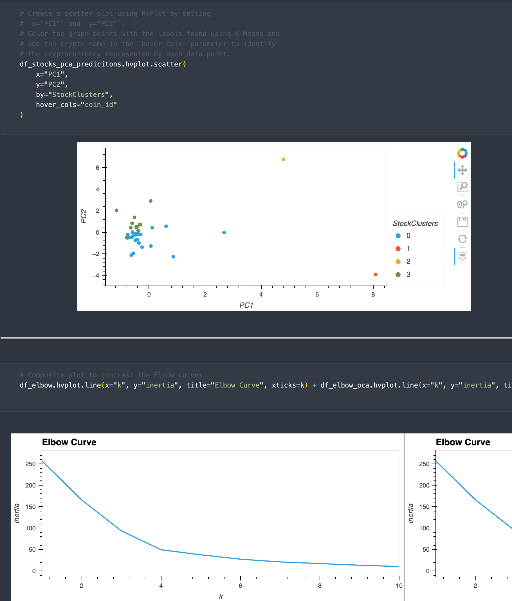

# Crypto Investments

This notebook utilizes  unsupervised learning to cluster cryptocurrencies by their performance in different time periods. 

---

## Technologies

This project leverages Python 3.7 with the following packages:

* [Pandas](https://pandas.pydata.org/docs/) - Data analysis and manipulation tool

* [Path](https://docs.python.org/3/library/pathlib.html) - Offers classes representing filesystem paths with semantics appropriate for different operating systems

* [NumPy](https://numpy.org/doc/stable/) - Fundamental package for scientific computing in Python

* [hvPlot](https://hvplot.holoviz.org/https://hvplot.holoviz.org/) - A familiar and high-level API for data exploration and visualization

* [ScikitLearn](https://scikit-learn.org/stable/install.html) - Open source data analysis library for Machine Learning (ML) in the Python ecosystem

---

## Installation Guide

Before running the application, first install the following dependencies.

```python
  pip install pandas
  pip install pathlib
  pip install numpy
  pip install hvplot
  pip install scikit-learn
```

---

## Examples

Upon running the notebook, you will see several graphics assisting in your analysis



---

## Usage

To use the crypto investments notebook, open crypto_investments.ipynb in a Jupyter Lab environment (or other IDE with Jupyter notebook extensions):

---

## Contributors

Pull requests are welcome. For major changes, please open an issue first to discuss what you would like to change.

Please make sure to update tests as appropriate.

---

## License

N/A
